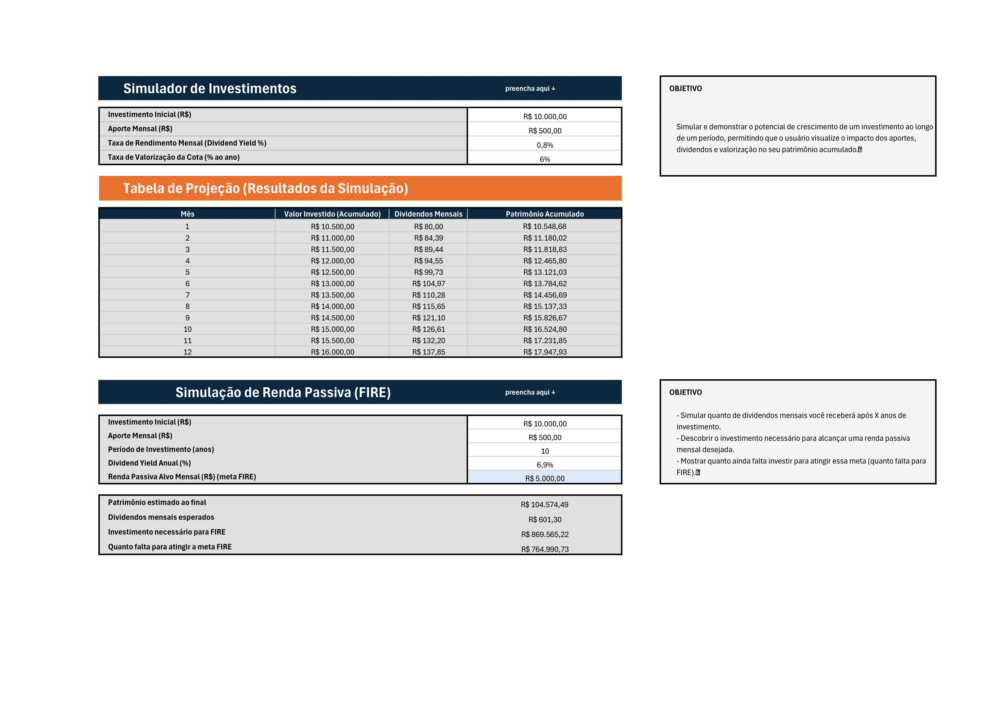

# 📊 Simuladores de Investimentos e Renda Passiva (FIRE)

Bem-vindo ao nosso painel de simulação financeira! Esta ferramenta, desenvolvida em planilha, foi criada para oferecer uma visão completa sobre o crescimento de investimentos e o planejamento para a independência financeira (conceito FIRE - *Financial Independence, Retire Early*).

A planilha contém **dois simuladores poderosos e complementares**:

1.  **Simulador de Investimentos:** Projeta o crescimento do seu patrimônio mês a mês.
2.  **Simulação de Renda Passiva (FIRE):** Calcula o patrimônio necessário para atingir sua meta de renda passiva mensal.

---

## 🛠️ Como Usar

1.  **Baixe a Planilha:** Faça o download do arquivo `.xlsx` deste repositório.
2.  **Abra o Arquivo:** Utilize um software como Microsoft Excel, Google Sheets ou LibreOffice Calc.
3.  **Preencha os Campos:** A planilha está dividida em dois simuladores. Preencha as áreas indicadas com "preencha aqui ↓" para cada um deles.

### 1. Simulador de Investimentos (Projeção Detalhada)

Ideal para visualizar o efeito dos juros compostos no curto e médio prazo. Preencha os seguintes campos:

* **`Investimento Inicial (R$)`**: O valor com o qual você está começando.
* **`Aporte Mensal (R$)`**: O valor que você planeja investir todos os meses.
* **`Taxa de Rendimento Mensal (Dividend Yield %)`**: O percentual de dividendos que seus investimentos geram por mês (ex: 0,8%).
* **`Taxa de Valorização da Cota (% ao ano)`**: O percentual que você espera que seus ativos valorizem anualmente (ex: 6%).

➡️ **O Resultado** será exibido na **"Tabela de Projeção"**, mostrando a evolução mensal do seu patrimônio, valor investido e dividendos recebidos.

### 2. Simulação de Renda Passiva (FIRE)

Ideal para planejar seu objetivo de longo prazo de viver de renda. Preencha os seguintes campos:

* **`Investimento Inicial (R$)`**: O valor inicial que você já possui.
* **`Aporte Mensal (R$)`**: O valor que você irá investir mensalmente.
* **`Período de Investimento (anos)`**: Por quantos anos você planeja fazer os aportes.
* **`Dividend Yield Anual (%)`**: A taxa de dividendos anual esperada da sua carteira consolidada (ex: 6,9%).
* **`Renda Passiva Alvo Mensal (R$)`**: Sua meta de quanto deseja receber de renda passiva por mês (ex: R$ 5.000,00).

➡️ **O Resultado** será um resumo direto do seu plano FIRE:
* **`Patrimônio estimado ao final`**: O valor total que você terá acumulado após o período de investimento.
* **`Dividendos mensais esperados`**: A renda passiva que seu patrimônio estimado irá gerar.
* **`Investimento necessário para FIRE`**: O valor total que você precisa ter investido para que os dividendos paguem sua meta de renda passiva.
* **`Quanto falta para atingir a meta FIRE`**: A diferença entre o patrimônio necessário e o que você terá acumulado no período.

---

A planilha contém **dois simuladores poderosos e complementares**: [Planilha Online - Simuladores de Investimentos e Renda Passiva](https://1drv.ms/x/c/2fafee40bc4a3b74/EQ6hShHrenxIgSPhx4_H3YMBoSqxbr4zdmazS7RfdH5pSw?e=kJaPIE)

**LARISSA S GOIS** - [https://www.linkedin.com/in/larissa-gois/](https://www.linkedin.com/in/larissa-g%C3%B3is/)
